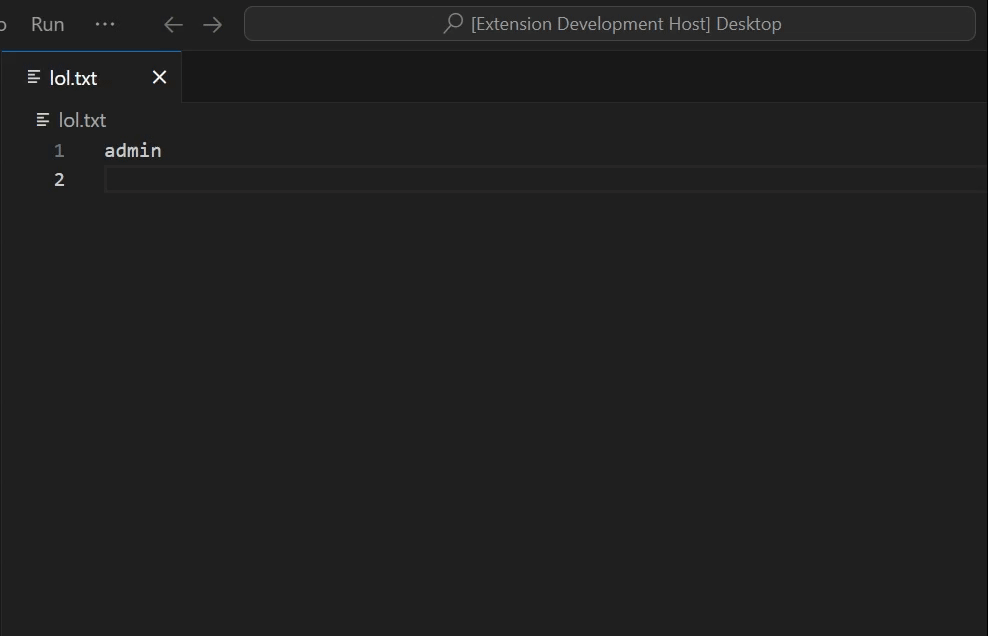

#  Inline Cryptography Toolkit

## Overview

The **Inline Cryptography Toolkit** is a powerful Visual Studio Code extension that allows users to perform various cryptographic operations directly within the editor. This extension supports encryption, decryption, and hashing methods, making it an essential tool for developers, security professionals, and anyone working with sensitive data.

With a simple right-click menu, you can easily encrypt or decrypt selected text, or hash it using popular algorithms, all without leaving the editor. The extension supports a range of cryptographic methods, including symmetric encryption, public-key encryption, and multiple hashing algorithms.

---

### Quick Demo  

To see how the **Inline Cryptography Toolkit** works, check out this quick demo:  

  

This demonstration shows how to:  
- Encrypt and decrypt selected text.  
- Hash text using different algorithms.  
- Use the extension's right-click menu for cryptographic operations.  

---

## Features

- **Encryption Methods**:
  - AES
  - Blowfish
  - RSA (Requires a private/public key)
  - Base64 (No key required)
  - Base32 (No key required)

- **Decryption Methods**:
  - AES
  - Blowfish
  - RSA (Requires a private key)
  - Base64 (No key required)
  - Base32 (No key required)

- **Hashing Methods**:
  - SHA256
  - SHA512
  - MD5

- **Smart Key Handling**: Only prompts for encryption/decryption keys when needed (AES, Blowfish, RSA).
- **Right-click Menu**: Easily encrypt, decrypt, or hash selected text directly within the editor.

---

## Installation

1. **Install the Extension**:
   - Go to the **Extensions** view in VS Code (`Ctrl+Shift+X`).
   - Search for "**Inline Cryptography Toolkit**".
   - Click **Install**.

2. **Manual Installation**:
   - Download the extension from the [Visual Studio Code Marketplace](https://marketplace.visualstudio.com/).
   - Install by selecting **Install from VSIX** in the Extensions view.

---

## Usage

After installing the extension, you can use it by:

1. **Selecting Text**: Highlight the text you want to encrypt, decrypt, or hash.
2. **Right-click on the Selection**: A context menu will appear with the following options:
   - **Encrypt Selected Text**: Encrypts the selected text using your chosen encryption method.
   - **Decrypt Selected Text**: Decrypts the selected text using your chosen decryption method.
   - **Hash Selected Text**: Hashes the selected text using your chosen hashing method.

3. **Choose an Algorithm**: When you select one of the options, you'll be prompted to choose the cryptographic algorithm. Some algorithms require a key (e.g., AES, Blowfish, RSA), while others (e.g., Base64, Base32) do not.

4. **Enter Key (if required)**: If the algorithm requires a key (AES, Blowfish, RSA), you'll be prompted to enter it.

5. **See the Result**: The selected text will be replaced with the encrypted, decrypted, or hashed result, depending on the option you chose.

---

## Supported Algorithms

### Encryption Algorithms
- **AES** (Symmetric encryption)
- **Blowfish** (Symmetric encryption)
- **RSA** (Asymmetric encryption, requires public/private key)
- **Base64** (No key required)
- **Base32** (No key required)

### Decryption Algorithms
- **AES** (Symmetric decryption)
- **Blowfish** (Symmetric decryption)
- **RSA** (Asymmetric decryption, requires private key)
- **Base64** (No key required)
- **Base32** (No key required)

### Hashing Algorithms
- **SHA256**
- **SHA512**
- **MD5**

---

## Configuration

The extension doesn’t require any special configuration out of the box. Once installed, it should be ready to use.

If you want to customize the extension or add more cryptographic algorithms, you can modify the source code and contribute to the project.

---

## Example Use Cases

1. **Encrypting Passwords**: Encrypt a password before storing it or sending it over a network.
2. **Decrypting Data**: Decrypt sensitive information such as API keys or configuration values.
3. **Hashing Data**: Quickly hash a password or string using SHA256 or MD5 for comparison or storage.

---

## Contributing

Contributions to improve or extend this extension are welcome. You can contribute by:

1. **Forking the repository**.
2. **Creating a new branch** for your feature or bug fix.
3. **Submitting a pull request** with your changes.

Please ensure that your contributions maintain the professionalism and security of the extension.

---

## License

This extension is licensed under the MIT License. See the [LICENSE](LICENSE) file for more details.

---

## Troubleshooting

- **If the encryption/decryption isn’t working**: Ensure that you are using the correct key for algorithms like AES, Blowfish, and RSA.
- **If the extension isn’t showing in the right-click menu**: Try restarting VS Code and ensure that the text is selected.

If you encounter any issues, feel free to open an issue on the [GitHub repository](https://github.com/ktauchathuranga/inline-cryptography-toolkit/issues).

---

## Acknowledgments

- This extension uses **CryptoJS** for symmetric encryption, decryption, and hashing, and **node-forge** for RSA encryption and decryption.
